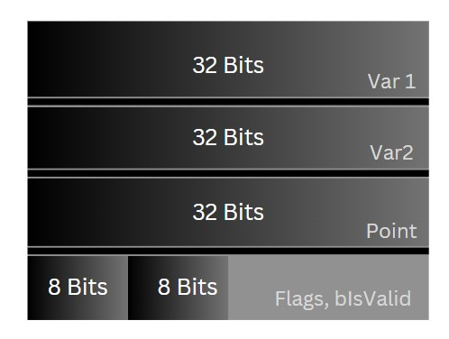

# Object Layout In Memory

## Objective of this Section
Ever wondered how objects are stored in the memory? it's a pretty cool concept, and can come
useful in cases when you want to optimize memory. After knowing this you will equip yourself with
knowledge to effectively create classes and structs in a more memory efficient way.

## How objects are stored?
Let's start by taking the following example,

```C++
struct InefficientStruct
{
    /* Size in Memory = 20 bytes (4 bytes * 5) */
    uint32 Var1;    // 32 bits
    bool bIsValid;  // 8 bits 
    int32 Var2;     // 32 bits
    float Point;    // 32 bits
    uint8 Flags;    // 8 bits
}
```

This is how we normally create structs, without taking order of the variables into account, but
that is inefficient because of something called `Alignment`.

## What is Alignment?

### Order Matters
In the above example we can see that, the variables are in different sizes and not sorted
in the order of decreasing sizes, it might not seem like that matters, but it does.  

We assume that the compiler simply packs all these variables as tightly as possible, 
but that's not the case. See `Fig1`, there are `holes` in between different variables,
holes in the sense unused memory. This is because every data type has something called the
`natural alignment`, which lets the processor read the data faster. 

<figure markdown="span">
  { width="300" }
  <figcaption>[Fig1] Non-Aligned in Memory</figcaption>
</figure>

### Why Aligned read is faster?

`Alignment` refers to, if the address of the data in the memory are in multiples
of the size of the data. Let me explain clearly with an example, consider this struct
```C++
struct Aligned8
{  
    uint8 Flags;   // 8 bits
    bool bIsValid; // 8 bits
    char Key;      // 8 bits
    int8 Mode;     // 8 bits
}
```
In the above example we can see all the data are of size 8 bit, this means that each data
takes 1 byte in the memory, so if the processor wants to read the second variable`bIsValid`,
it can easily add 1 byte to the memory address of the first data `Flags` to get the value of
the variable `bIsValid`. If the processor wants to get the address of the 4th variable 
`Mode`, we can use the multiple of the size of the data type to get the address,
```
// Multiplied by 3, because it's the 4th variable, for 3rd it would be 2
Address of 'Mode' = Address of 'Flags' + 3 * (1 byte)
```
So if we consider the case of multiple variables with 16 bits size, then that would be 
2 byte aligned, then the processor can easily multiply 2 bytes instead of 1 byte to get 
the address. The data can be aligned by 1 byte(8 bits), 2 bytes(16 bits), 4 bytes(32 bits), 
8 bytes(64 bits) etc.

- 1 byte aligned would be in consecutive memory or any memory (0x0, 0x1, 0x2)
- 2 bytes aligned would be in only in memory addresses of multiple of 2 (0x0, 0x2, 0x4)
- 4 bytes aligned would be in only in memory addresses of multiple of 4 (0x0, 0x4, 0x8, 0xC)
- 8 bytes aligned would be in only in memory addresses of multiple of 8 (0x0, 0x8, 0xF)

Most processors can **only** read and write properly aligned blocks of data, because if the
data is packed without leaving holes then, the data would be spread across two memory
addresses and the processor will read from two memory address then `mask` them, `shift` them, and then do `OR` to
get the values, so additional operations need to be done to read one data.

Instead, if it's aligned, just one read operation, and we can get the data. Some 
processors don't even go this far, they just give out garbage values or crash the program.

## Proper Alignment

Let's see how proper alignment looks like, consider the following struct. 
```C++
struct EfficientAlignedStruct
{
    /* Size in Memory = 16 bytes (4 bytes * 4) */
    uint32 Var1;      // 32 bits (4 byte aligned)
    int32 Var2;       // 32 bits (4 byte aligned)
    float Point;      // 32 bits (4 byte aligned)
    uint8 Flags;      // 8 bits (1 byte aligned)
    bool bIsValid;    // 8 bits (1 byte aligned)
}
```
The above example is aligned by 4 bytes(32 bits) and followed by the 1 byte alignment 
for the `Flags` and `IsValid` variable. So for the `EfficientAlignedStruct`, the memory
would look like `Fig2`

<figure markdown="span">
  { width="300" }
  <figcaption>[Fig2] Aligned in Memory</figcaption>
</figure>

You might think that the size of the struct object in memory would be 14 bytes, no it's
not, it's 16 bytes. Since the entire struct follows 4 bytes alignment, 2 bytes that is 
left in the last memory address(refer `Fig2`) is padded by the compiler leaving it empty.

Imagine a scenario of having an array of these `EfficientAlignedStruct` struct. If the struct
is 4 byte aligned like in here, then array access is also very easy. 

You can explicitly specify the wasted space like follows, adding this does not have any effect
in terms of memory, the object would still occupy the same space.

```C++
struct EfficientAlignedStruct
{
    /* Size in Memory = 16 bytes (4 bytes * 4) */
    uint32 Var1;      // 32 bits (4 byte aligned)
    int32 Var2;       // 32 bits (4 byte aligned)
    float Point;      // 32 bits (4 byte aligned)
    uint8 Flags;      // 8 bits (1 byte aligned)
    bool bIsValid;    // 8 bits (1 byte aligned)
    int8 _padding[2]  // explicit padding 
}
```
## References :

1. `Game Engine Architecture` book, by Jason Gregory.