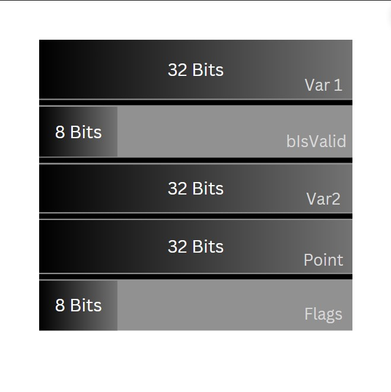

# Object Layout In Memory

## Objective of this Section
Ever wondered, how objects are stored in the memory? it's a pretty cool concept, and can come
useful in cases when you want to optimize memory. After knowing this you will equip yourself with
knowledge to effectively create classes and structs in a more memory efficient way.

## How objects are stored?
Let's start by taking the following example,

```C++
struct InefficientStruct
{
    uint32 Var1;    // 32 bits
    bool bIsValid;  // 8 bits
    int32 Var2;     // 32 bits
    float Point;    // 32 bits
    uint8 Flags;    // 8 bits
}
```

This is how we normally create structs, without taking order of the variables into account, but
that is inefficient because of something called `alignment`.

## What is Alignment?

In the above example we can see that, the variables are in 

<p align="center">
  
  <br/>
  <em>Image caption</em>
</p>

<figure markdown="span">
  { width="300" }
  <figcaption>Image caption</figcaption>
</figure>